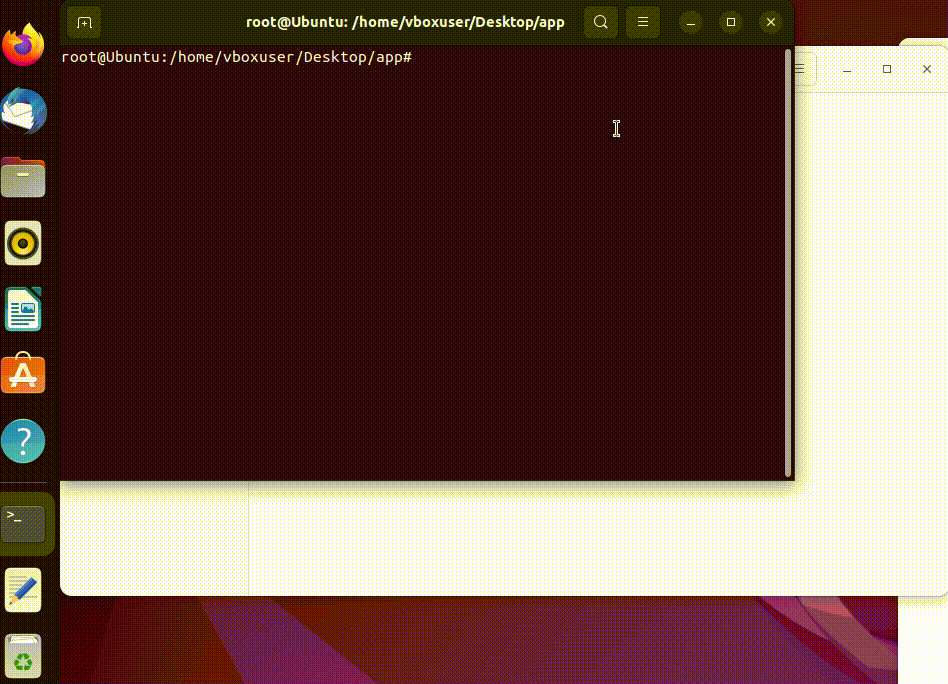

# To-do List Project with Marking as Complete & Uncomplete
A Todo list derived from data-flair.training, adding marking as Uncomplete feature and Dockerizing it

# Demo


# Todo List Features
<code>+</code> Add task

<code>+</code> Delete Selected Task

<code>+</code> Mark as Completed

<code>+</code> Mark as Uncompleted


# About it
 
- Uses Tkinter Library since it is a GUI application
- Runs only on python3+ since python2 doesn't support our checkmark which could be changed incase python2 was needed.
- Added a new function and button (Mark Uncomplete function)
  - If statement to check whether it already has the checkmark or not to display a warning.


### Instllation and Usage: 

It requires tkinter package and it should be installed using this command

Linux: 
```
sudo apt-get install python3-tk
```

Then run it:

```
python3 todo.py
```

Windows Users have it already installed by default so just run it by
```
python todo.py
```

### Dockerizing the Application:
Since Docker containers don't allow GUI because that's how computers work apparently and there is no universal display for all operating systems, however there are some workarounds, and this just works for Linux (tested on Ubuntu 22.04.2 LTS)

- Here's what inside our `DockerFile`:
```

# Slim version of Python

FROM python:3.8.12-slim


# Download Package Information

RUN apt-get update -y


# Install Tkinter

RUN apt-get install tk -y


# Copying our Todo application
ADD todo.py .


# Commands to run Tkinter application

CMD ["todo.py"]

ENTRYPOINT ["python3"]

```
Building a Dockerized image: 

```
docker build -t todo_in_docker .
```

You can either run it by pasting the command below or just save it in shell file and making it executable

Running the command: 
```
docker run -u=$(id -u $USER):$(id -g $USER) -e DISPLAY=$DISPLAY -v /tmp/.X11-unix:/tmp/.X11-unix:rw -v $(pwd)/app:/app --rm todo_in_docker
```

Saving it in a run.sh which would look like this: 
```
#!/bin/bash

docker run -u=$(id -u $USER):$(id -g $USER) -e DISPLAY=$DISPLAY -v /tmp/.X11-unix:/tmp/.X11-unix:rw -v $(pwd)/app:/app --rm todo_in_docker
```
Making it executable by:

```
chmod +x ./run.sh
```
Running it by:
```
./run.sh
```
# Changelog
- v 1.0
  - The first version of the program

# Credits

- `data-flair.training` for releasing this todo list application as an open source.
- `towardsdatascience` for having a tutorial article explaining how to run GUI applications in docker.


